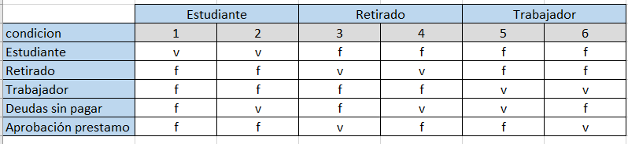

# Tabla de Decisión - puedeAprobarPrestamo

        				
                        
1. Si la persona es estudiante → NO se aprueba, aunque no tenga deudas.						
2. Si la persona es empleado/trabajador → SÍ se aprueba, aunque tenga deudas.						
3. Si la persona es retirado → SÍ se aprueba si no presenta deudas.						
4. Si la persona es retirado → NO se aprueba si presenta deudas						
                        

